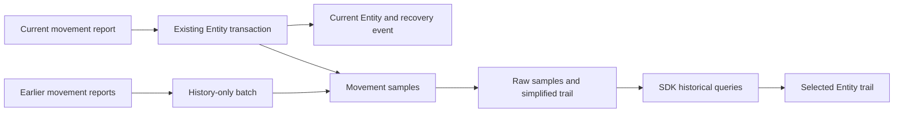

# Movement history and trails

Status: approved design implemented locally on 2026-09-09. See [implementation and validation](movement-history-implementation.md) for exact routes, limits and measured capacity.

The [design interview](movement-history-design-interview.md) distinguishes user decisions from the assumptions in this proposal. Its decision ledger takes precedence where an implementation detail below is still open. Rounds 1 and 2 settled independent speed/altitude reports, retention timing, history-only backfill, arrival-time fallback, no manual editing, last-known-value inspection, sea-level altitude, a one-hour initial window, and accepting eligible records from mixed-age uploads. Round 3 sets both the field-age cue and position-gap threshold to more than one minute, enables following in the recent view, and chooses hover preview with click-to-pin inspection. Round 4 gives current markers priority over overlapping historical points, confines report stepping to focused history controls, and dismisses pinned historical details before Entity selection on Escape while preserving active tool/dialog priority. All 16 behavioral questions are answered and the user confirmed the final shared understanding on 2026-09-09. The user subsequently selected the existing sidebar for all history controls and readings, using current UI elements. The user approved the revised sidebar mock, including its control arrangement and dotted gap connectors. Both the interview and visual review gates are complete.

Source inspection used checkout `55775b5c52668ddf0ac7d6528f4e11004a6b9e72`. Findings describe local source, not a deployed database. No performance or physical-radio validation was performed.

## Agreed requirements

- Retain explicitly reported position, speed and altitude independently. Omitted fields stay omitted. Battery, connection quality, sensor readings, status and complete Entity snapshots are outside this feature.
- Support one selected Asset or Track. Whole-map replay and cross-Entity historical analysis are outside the intended experience.
- Include backfill in v1. A producer can collect observations before identifying a Track, create the Track once identified, and attach the earlier observations to it.
- Retain original movement samples for 30 days from observation time when known, otherwise from arrival time. Display simplification is separate from raw retention. A report measured 29 days ago and received today has one day left.
- Expect 10 to 25 Entities in the system. Assets report every one to five seconds at the upper end; Tracks report every few seconds.
- Entity identity, Track association, Asset disconnect/reconnect and process lifecycle belong to their existing owners. Movement history must not take over those responsibilities.

## Implemented design

Use one dedicated movement-sample table in Core's existing PostgreSQL database. Normal Entity writes capture explicitly supplied movement values in their existing transaction. A separate bounded ingestion operation appends historical movement reports without changing the live Entity. Both paths use the same sample validation and insertion code.

Expose raw samples and a map-ready trail through Protocol and the SDK. Historical results stay outside the SDK's current-state cache.

A sample contains any supplied position, speed or altitude. A speed-only or altitude-only report is a valid sample. A position is a complete latitude/longitude pair. Require at least one supported movement quantity, and preserve zero values. Never fill absent quantities from the merged current Entity. Do not copy unrelated components. For example, a stationary Sentry reporting only a battery change creates no movement sample and does not refresh its recorded position time. Inspection may show earlier known values without rewriting samples. Avoid redundant timestamps. Display an age cue only when a shown quantity was reported more than one minute before the inspected historical time, and keep exact times inspectable. Compare against historical inspection time, not the present wall clock.



## Existing code and constraints

| Confirmed behavior | Evidence | Design consequence |
| --- | --- | --- |
| Assets and Tracks share the Entity model. | [Domain glossary](../CONTEXT.md), [Entity actions](../services/core/internal/actions/entity_actions.go) | One feature covers both. |
| Check-ins call the ordinary Entity update action. | [Check-in actions](../services/core/internal/actions/entity_checkin_actions.go) | Capture inside create/update actions covers existing HTTP producers. |
| Incoming component maps merge into existing state. | [JSON merge](../services/core/internal/actions/json_blob_contracts.go) | Capture supplied movement fields before merging, not fields carried forward afterward. |
| Check-in conversion stamps telemetry with Core time and refreshes heartbeat. | [Request conversion](../services/core/internal/api/handlers/handler_requests.go) | Existing telemetry timestamps are not a uniform observation-time contract. |
| The change hook receives the resulting Entity. | [Change hook](../services/core/internal/actions/change_hook.go) | Reuse the transaction, but do not infer observations from the after-state. |
| Recovery events expire after seven days. | [Retention](../services/core/internal/actions/change_retention.go), [feed contract](atlas-change-feed/README.md) | Keep the new 30-day sample store separate. |
| Current resource versions are commit-ordered through a locked change clock. | [Write version](../services/core/internal/actions/write_version.go) | History-only writes must not introduce unexplained gaps in the resource feed. |
| Current Entity metadata includes database-created time. | [Entity model](../services/core/internal/models/models.go), [serializer](../services/core/internal/serializers/serializers.go) | Reuse existing record context; do not invent Asset or Track lifecycle management. |
| The SDK cache retains current resource state. | [SDK cache](../packages/sdk/src/cache.ts), [client](../packages/sdk/src/client.ts) | Historical reads must neither populate the live cache nor advance its cursor. |
| The map has a source/layer registration and style reload lifecycle. | [MapView](../surfaces/command-interface/src/ui/map/view/MapView.tsx), [map layers](../surfaces/command-interface/src/ui/map/rendering/map-layers.ts) | Add a separate historical overlay within that lifecycle. |

## Sample meaning and capture

A movement sample records only supported quantities actually supplied. A fresh report at identical coordinates is still a new position report. Speed-only and altitude-only updates create samples with no position. Heartbeat-only, battery-only and name-only updates create no movement sample. A latitude-only input does not create a complete position; any independently supplied speed or altitude can still be retained. The existing live patch behavior stays unchanged.

Capture the normalized input component map inside `EntityActions.Create` and `EntityActions.Update`, before recursive merge. Position, speed and altitude each come only from the supplied telemetry map. Capture only Assets and Tracks. Do not treat a geometry representative point as a measured position.

For ordinary writes, insert the sample in the transaction that writes the Entity and recovery event. If either write fails, the whole transaction rolls back. History capture must also cover Entity creation with any supplied movement values. Do not synthesize historical reports from a current Entity when enabling the feature.

Each sample needs a stable sample ID, Entity association, Atlas arrival time, optional source observation time, and the supported movement values that arrived. Capture arrival time at the request boundary before normalization and retain it through the transaction; database insertion time is not a substitute for receipt time. An internal insertion sequence supports pagination and refresh. A normal-write sample may also retain the associated resource version as provenance; a backfilled sample has no corresponding Entity mutation version.

Use a typed optional movement observation-time input on ordinary create/update/check-in requests when callers know the measurement time. Validate it alongside supplied movement values. The final field name remains proposed. Keep its meaning separate from existing `telemetry.last_update`, which can be refreshed for non-position updates. Existing callers without this new input still work; their samples have unknown observation time and a known Atlas arrival time.

The displayed sample time is source observation time when known, otherwise Atlas arrival time. Return the time basis so a receipt-timed sample is never presented as sensor-timed. Preserve both times. The insertion sequence orders acceptance; wall-clock timestamps are not assumed monotonic.

Altitude means meters above mean sea level. Sources using another reference must convert before publication; history must not silently reinterpret existing values. See the [altitude decision](design-decisions/2026-09-09-movement-altitude-uses-mean-sea-level.md). Source verification remains implementation work.

## Backfill in v1

Proposed operation:

```text
POST /entities/{entity_id}/movement-history
```

The Entity must already exist. The producer owns association and supplies the earlier samples for that Entity. Source observation times may precede the Entity's creation time, which is the identified-Track use case. This system does not hold unidentified observations or decide which Track they belong to.

Each submitted sample requires a stable caller-supplied sample ID and at least one supported movement quantity. A known observation time places a backfilled report in the earlier timeline. A report without that time is still retained using Atlas arrival time and is labeled accordingly; Atlas cannot reconstruct its earlier measurement time. Positions require both coordinates, but speed and altitude can arrive independently. Repeating the same sample ID and values is idempotent; reusing the ID with different values returns a conflict. Equal timestamps or equal coordinates alone are not duplicates. This is bounded ingestion retry protection, not a new transport-level delivery system.

Process an explicitly bounded batch. Initial candidate limits are 500 samples and 256 KiB per request, to be checked against Protocol and Core conventions during implementation. Keep eligible reports and skip expired reports, returning accepted, already-present and expired counts. Commit the eligible subset atomically. Expiry is not an error that rejects useful reports in the same request. Structural errors and conflicting sample IDs still follow the proposed whole-request validation rule; they are distinct from expected expiry.

Backfill only appends history, even when the Entity has no current position yet. It does not move the live marker, alter heartbeat, update speed/altitude on the current Entity, or emit a pretend Entity update. Producers use the existing Entity operations separately when they want to publish current state. This supports delayed delivery without adding automatic reconciliation of older measurements into live state.

Accepted retention semantics are a rolling 30-day observation window, using Atlas arrival time when source time is unknown. Samples outside that window are not retained. An upload containing expired and eligible samples keeps the eligible reports, skips the expired ones, and reports the counts. Do not reject a sample merely because it predates Entity creation. Validate future observation timestamps explicitly and report clock errors rather than silently replacing source time. Final clock-skew tolerance is an implementation constant to document and test.

Create-then-backfill uses the existing Entity creation/recovery behavior and retry-safe sample batches. It does not require a combined creation/history transaction or a new pending-Track resource. An interrupted importer can resume the same batches.

Manual correction or removal of historical samples is excluded from v1. Retention still expires old samples automatically.

## Entity ownership

Movement history consumes the Entity association supplied by the caller and validated by Core. It does not identify subjects, merge Tracks, change Asset runtime IDs, or interpret disconnect/reconnect as a new Entity.

When attaching samples, bind them to the existing Entity record, not merely an alias. The implementation copies its existing `created_at` alongside `entity_id` and use that association in selected-Entity queries and backfill preconditions. This reuses Core's record context without adding a history-defined generation or registration process. It allows observations from before creation while preventing a later replacement row from automatically inheriting the previous row's samples. Create/delete association behavior is covered by the database tests.

Do not cascade-delete sample history as an incidental schema choice. Retain it under the 30-day policy, while the initial UI only exposes the selected current Entity's association. Historical browsing of deleted Entities is not a v1 UI requirement. Owner-driven deletion or data-purge policy remains a separate explicit concern.

## Storage and transaction ordering

The `entity_movement_samples` table has named columns for the sample fields. Position is optional but requires a complete coordinate pair when present; speed and altitude are individually optional, with at least one movement quantity required. There is no generic JSON event log, complete Entity snapshot, separate time-series service, or delta-reconstruction engine.

Use indexes for Entity association plus sample time, insertion sequence, sample-ID uniqueness and retention pruning. Add the next migration, currently v10, and update the managed table list, scratch reset, checksums and catalog tests. Production restarts and backups preserve samples; development scratch mode resets them.

History-only imports need their own sample insertion sequence. Do not increment `atlas_change_clock` without a canonical resource event, and do not rely on an unconstrained sequence maximum as a safe snapshot watermark.

For this selected-Entity scope, the implementation serializes all sample insertion for an Entity under its existing row lock and allocate sample sequence values only after acquiring that lock. Ordinary mutations already lock the Entity; an import locks the same row, then inserts its bounded batch. History-only imports never acquire the resource change clock afterward. This keeps existing lock ordering intact and makes the per-Entity committed sequence a usable upper bound. Prove this with concurrent import/current-write tests rather than assuming global identity sequence values imply commit order.

History pruning uses bounded transactions. If pruning advances into a paginated interval, return explicit retention metadata. Expire the cursor when its last report is no longer retained; still-retained pages remain readable. Store retention/capture metadata separately from guesses based on the first returned point.

## Reads and map behavior

Read operations (all require the current `entity_created_at` association):

```text
GET /entities/{entity_id}/movement-history?from=<UTC>&to=<UTC>&cursor=<opaque>
GET /entities/{entity_id}/trail?from=<UTC>&to=<UTC>&max_points=<n>
```

Raw reads return retained samples, both timestamps, time basis, and cursor/coverage metadata. Bind continuation to the Entity association, fixed interval, last sample-time/sequence key and fixed committed upper sequence. A backfill arriving between pages can have an earlier observation time, so it belongs in the next refresh, not unpredictably inside the current pagination. Use named Protocol request/response types, generated validators and normal authenticated SDK transport.

A successful trail response represents the whole requested interval at a declared detail level. It preserves endpoints and meaningful segment breaks. It must not return only the first page and label it a complete trail. Raw samples remain available for exact inspection. Raw samples keep absent quantities absent. Point inspection can show the last reported value of each movement quantity at or before the selected historical time. Read retained predecessors when the earlier reading falls before the displayed interval; never borrow a future sample or invent a value when no retained predecessor exists. Keep the original time of each displayed quantity available. Suppress redundant timestamps; show an age cue only for a quantity reported more than 60 seconds before the selected historical time. Trail geometry uses position-bearing samples only; independent speed/altitude samples must still be accessible through historical inspection.

Bound database work as well as point count and response bytes. A count-before-read does not establish a work bound. Measure an indexed streaming reduction at the expected per-Entity depth, with explicit scan and execution budgets. If the server cannot summarize the requested interval within its budget, return an explicit range/budget error rather than a silently incomplete trail. If measured long-window use requires precomputed summaries, add them behind this same read contract. They must preserve gap information and accommodate late insertions.

Represent meaningful gaps with a different line style between known endpoints, not the ordinary trail style. Use the dotted connectors shown in the approved sidebar mock. A gap connector does not claim that the Entity followed that route, stopped, or disconnected. A gap is more than 60 seconds between actual position reports. Battery, heartbeat, speed-only and altitude-only updates do not reset the position-report interval. Preserve antimeridian behavior and valid zero/one-point output. Do not infer a raw reporting gap solely from the time between already-simplified vertices.

The Command interface holds historical query results separately from live Entity state. The recent view follows new reports. Selecting an earlier reported point or a past interval holds that historical time/window steady until the operator returns to the recent view. Keep the pinned readings steady during automatic live refreshes; do not replace them from the latest Entity cache. The rest of the map and the Entity current marker remain live. Fetch only for the selected Entity and interval, cancel obsolete requests, and reconcile after reconnect or an explicit refresh. A small conditional refresh in the following view can detect backfill submitted elsewhere without introducing new resource-feed event variants. Historical queries never expire or resurrect live Entities or move the live marker.

The UI initially shows the last hour when history is opened, with another interval selectable within the retained 30 days. It shows a trail and inspection of position, speed and altitude without repeated timestamps on every field. Use the accepted more-than-one-minute age cue and recent-view following behavior. Hovering an actual reported point previews historical readings; clicking pins them without changing parent Entity selection or replacing the live marker. Active drawing and command interactions retain their existing behavior. Current Entity markers take priority over overlapping historical points; those reports remain reachable through history controls. Left/right arrows step reports only inside focused history controls, leaving existing navigation elsewhere unchanged. Escape dismisses pinned historical details before clearing the selected Entity, while active tools and dialogs retain their existing priority. Use the existing AssetInspector/TrackInspector sidebar, Section, FieldGrid and control primitives. Add Movement History after Location & Movement while preserving the existing inspector sections and navigation. Keep all history controls, readings and the gap legend inside that sidebar. The map only gains the trail and historical-point overlay. The user rejected broader UI changes, including a bottom strip and a floating report window. Implement the approved sidebar mock with the existing components; preserve the agreed selection, drawing, focus and keyboard behavior. No whole-map timeline or continuous animation is required.

## Capacity and validation

The small Entity count does not make a month of frequent reports a small row count:

| Assumed continuous load | Samples per day | Samples over 30 days |
| --- | ---: | ---: |
| 10 Entities, one report every 5 seconds | 172,800 | 5,184,000 |
| 25 Entities, one report every 2 seconds | 1,080,000 | 32,400,000 |
| 25 Entities, one report every second | 2,160,000 | 64,800,000 |

These are arithmetic envelopes, not forecasts or benchmarks. One Entity at one sample per second produces 2,592,000 samples in 30 days. Measure actual row/index size, write latency during reads, retention cleanup and trail generation before selecting query limits or claiming the storage footprint. Start with PostgreSQL and evaluate partitioning only if measured pruning/table size warrants it; any dynamic partitions must respect Core's schema fingerprint policy.

Implementation sequence completed:

1. Author the sample, batch, timestamp and read contracts in Protocol. Preserve the agreed scope and document the 30-day retention semantics.
2. Add the table and shared capture/ingestion code, including input-based capture, history-only backfill, sample-ID retry behavior and existing Entity association checks.
3. Implement raw pagination and interval-wide trail reduction with honest coverage and tested work limits.
4. Add SDK methods that leave the live cache and global synchronization cursor unchanged.
5. Implement the selected UI design and verify it in the browser. The [design interview](movement-history-design-interview.md) records the approved sidebar placement, controls and gap style. Reuse the real Section, FieldGrid and control components; the mock shell and fixture code are not implementation inputs.

Focused proof must cover the exact 60-second and greater-than-60-second age/gap boundaries, using historical time for age cues, automatic following versus pinned inspection, independent live-marker updates, hover versus pinned detail, current-marker priority over overlapping history points, access to those reports through history controls, focused report stepping, Escape precedence, stationary reports; battery/heartbeat-only updates producing no sample; speed-only and altitude-only samples with no invented position; latitude-only updates; absent values and numeric zero; rollback; samples predating Track creation; batches arriving out of order; repeated and conflicting sample IDs; backfill leaving the live Entity unchanged; creation/replacement association; concurrent pagination/import; retention expiry; geometry gaps and antimeridian crossing; and SDK cancellation/cache isolation. Exercise the repository's loopback simulation safeguards and package check ladders for the modules changed.

## Why expansion does not require a replacement

The durable facts are explicit samples, their Entity association, their timing, and the separation between history and live state. Adding another measured value later can extend the typed sample and storage columns. Adding faster summaries can change the read implementation while preserving raw records and the API. Changing the display does not change capture or retention.

Neither future step requires turning this into full Entity revision history, inventing a generic component event language, or moving responsibility for Entity identity into the history feature. Those would be separate requirements, not prerequisites for this one.
