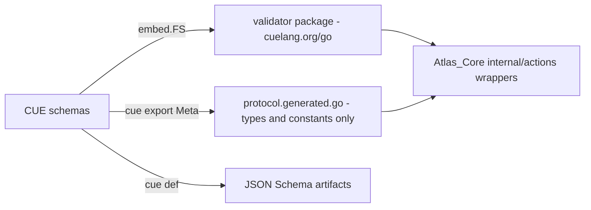

# Fix Architecture Review Findings

Seven workstreams, ordered so each lands independently (small → large). Greenfield rules apply: breaking changes preferred, no compatibility shims.

## 1. Close validation gaps (small, do first)

- Call `protocol.ValidateEntityBlob` / `ValidateTaskBlob` on the full decoded body in create/update paths in [Atlas_Core/internal/actions/entity_actions.go](Atlas_Core/internal/actions/entity_actions.go) and [Atlas_Core/internal/actions/task_actions.go](Atlas_Core/internal/actions/task_actions.go) (covers `published_at` and top-level extras).
- Delete dead `ValidateComponentKeys` from [Atlas_Core/internal/actions/component_validation.go](Atlas_Core/internal/actions/component_validation.go).
- Delete the duplicated (already-drifted) example set under `Atlas_Core/docs/database-structure/examples/`; point docs (incl. `docs/atlas-protocol/IMPLEMENTATION_PREP.md`) at `atlas_protocol/examples/`.

## 2. Extend If-Match to entities and tasks

Design: handlers own ETag strings; actions compare versions only. This also kills the actions/serializers ETag duplication.

- Generalize `ObjectStrongETag` in [Atlas_Core/internal/serializers/serializers.go](Atlas_Core/internal/serializers/serializers.go) to a resource-agnostic `StrongETag(version)`; add a parse helper (`If-Match` token → expected version, rejecting weak tokens) replacing the string matching in [Atlas_Core/internal/actions/ifmatch.go](Atlas_Core/internal/actions/ifmatch.go).
- Actions take `ExpectedVersion *int64` in update params; check against the row version after `FOR UPDATE` inside the change tx; mismatch → existing `PreconditionFailedError` (412 mapping already exists in `handler_http.go`).
- Set `ETag` headers on entity/task GET/create/update responses; honor optional `If-Match` on entity PATCH + checkin and task PATCH + status endpoints in [Atlas_Core/internal/api/handlers/handler_entity.go](Atlas_Core/internal/api/handlers/handler_entity.go) and [handler_task.go](Atlas_Core/internal/api/handlers/handler_task.go). Absent header keeps current behavior.
- Migrate the object path to the same version-comparison scheme; delete `objectIfMatchETag`.
- Promote [docs/problems/2026-05-29-entity-checkin-last-writer-wins.md](docs/problems/2026-05-29-entity-checkin-last-writer-wins.md) into a design decision describing the unified model; while there, write the missing design-decision doc for the global write lock (`write_version.go`) since sync cursor semantics depend on it.
- Unit + integration tests for 412 behavior on all three resources.

## 3. Derive runtime validators from CUE (largest item)

Replace the ~1,200 lines of hand-written validation logic in the `generatedGoTemplate` of [atlas_protocol/tools/internal/artifacts/artifacts.go](atlas_protocol/tools/internal/artifacts/artifacts.go) with CUE-backed runtime validation:

- Add `cuelang.org/go` (pinned v0.16.1, matching the CLI pin) to [atlas_protocol/go.mod](atlas_protocol/go.mod).
- New hand-written package (e.g. `atlas_protocol/validator/`): embed `schema/**/*.cue` via `embed.FS`, compile once with `cuecontext` + `load.Instances` overlay, expose the existing public surface (`ValidateEntityBlob`, `ValidateTaskBlob`, `ValidateObjectBlob`, `Validate*Component`, same `[]string` signatures) by unifying input values against the schema definitions — Atlas_Core's wrappers in `internal/actions/` keep compiling with only an import-path change.
- Strengthen CUE where the Go code was stricter so behavior is preserved: RFC3339 via `time.Format(time.RFC3339)` instead of the regex in [atlas_protocol/schema/shared/primitives.cue](atlas_protocol/schema/shared/primitives.cue); audit other Go-only checks (NaN/Inf is moot for JSON-decoded input — CUE encoding rejects non-finite floats anyway).
- Shrink `protocol.generated.go` to types, constants, and marshal/unmarshal helpers (still generated from `#Meta`); validation logic leaves the template entirely.
- Rework [atlas_protocol/protocoltest/validators_test.go](atlas_protocol/protocoltest/validators_test.go): keep behavioral cases (valid/invalid inputs), loosen exact error-message assertions where CUE wording differs; same for Atlas_Core component tests.
- `tools/check` drift gate stays for JSON Schema + the slimmed generated file; CUE↔Go drift becomes impossible by construction since the runtime validator reads the same schemas.

## 4. Split the actions god-package

- Break [Atlas_Core/internal/actions/](Atlas_Core/internal/actions/) into subpackages: `actions/entity`, `actions/task`, `actions/object` (incl. upload + storage deletions), `actions/sync` (query, cursors, streams, pagination), with shared error types (`ActionError`, `NotFoundError`, etc.) and tx helpers (`write_version.go`) in a small shared package — moved out of `entity_actions.go` where they currently live.
- Target the 200–300 line guideline; the 600–718-line files split naturally along CRUD/components/validation lines.
- While moving code, dedupe the model layer (medium finding): one shared `decodedJSON` cache helper for Entity/Task/MediaObject in [Atlas_Core/internal/models/models.go](Atlas_Core/internal/models/models.go), and a single promoted-field list shared between models and serializers.
- Pure mechanical move + handler import updates; no behavior change, full test run after.

## 5. Harden upload/outbox edge cases

- Fix the outbox `ON CONFLICT` upsert in [Atlas_Core/internal/actions/object_storage_deletions.go](Atlas_Core/internal/actions/object_storage_deletions.go) so a duplicate path doesn't silently reset retry state inconsistently (preserve/reset attempts deliberately).
- Route the post-commit old-blob delete on path replace in [Atlas_Core/internal/actions/object_upload.go](Atlas_Core/internal/actions/object_upload.go) uniformly through the outbox (queue in the metadata tx, attempt immediately after commit) so replace cleanup gets the same retry guarantees as deletes.
- Orphan-blob window (blob uploaded, metadata tx never commits): accept as-is — bucket is disposable scratch storage per design decision; note it in the upload code comment instead of building a sweeper.

## 6. Connect the command catalog

- Add real validation to [Atlas_Core/scripts/seed_command_catalog.py](Atlas_Core/scripts/seed_command_catalog.py) (required fields, unique command IDs, parameter schema sanity) so the README claim becomes true; fix [Atlas_Core/command_catalog/README.md](Atlas_Core/command_catalog/README.md) stale lines (validation claim, "no dedicated test" line).
- Seed the catalog in [.github/workflows/integration.yml](.github/workflows/integration.yml) so CI exercises the same startup path `atlas.py` mandates.

## 7. Infra, CI, and doc cleanup

- Prune workflow: add a retention window (delete only runs older than 14 days) in [.github/workflows/prune-old-runs.yml](.github/workflows/prune-old-runs.yml).
- Drop TimescaleDB for plain digest-pinned `postgres` in [Atlas_Core/docker/docker-compose.yml](Atlas_Core/docker/docker-compose.yml) + `init.sql` (extension is unused; adopt later only if telemetry needs it).
- CI gaps in [.github/workflows/ci.yml](.github/workflows/ci.yml): gofmt/vet/golangci-lint for `atlas_protocol`, run `scripts/test_compose_env.py`, `docker compose config` the tunnel overlay; add `atlas_protocol` gomod to [.github/dependabot.yml](.github/dependabot.yml); include `atlas_protocol` in nightly Trivy scan.
- `atlas.py`: persist auto-generated secrets to `docker/.env` instead of ephemeral per-run values; make the tunnel-verify hostname env-configurable (default stays `atlascommandapi.org`), same for `test_api_manual.py`.
- Doc fixes: `DATABASE_WORKFLOW.md` Postgres password claim, stale Railway refs in `.dockerignore`, refresh doc index revision dates, fix `Atlas_Core/README.md` Go version.
- Explicitly deferred (documented, no code): `readSnapshotVersion` O(tables) scan (fine at current scale), task FK `ON DELETE SET NULL` (record as intentional — tasks outlive entities; tombstones cover sync), health handler bypassing actions (appropriate for readiness checks).

## Verification

Each workstream ends with: `go test ./...` in both modules, `go run ./tools/check` in `atlas_protocol`, and the compose integration suite (`scripts/run_integration_tests.sh`) for workstreams 2, 5, and 6.